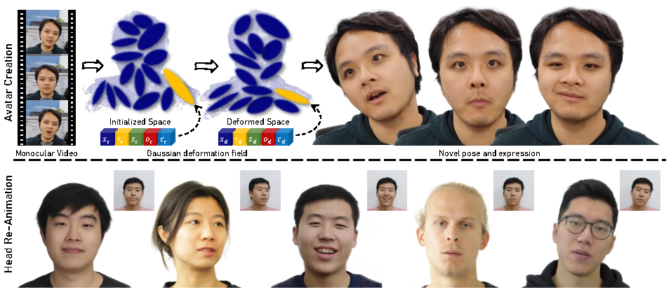

* B.S. in Electrical Engineering and Automation, Harbin Institute of Technology, 2017
* M.S. in Electrical and Electronic Engineering, University of Melbourne, 2020
* Ph.D. in Computer Science and Technology, Harbin Institute of Technology, 2025 (expected)

Publications
======

<b>MonoGaussianAvatar: Monocular Gaussian Point-based Head Avatar</b> 
<b>Yufan Chen</b>, [Lizhen Wang](https://lizhenwangt.github.io/), [Qijing Li](https://www.liuyebin.com/student.html), [Hongjiang Xiao](https://www.semanticscholar.org/author/Hongjiang-Xiao/2747760), [Shengping Zhang](http://homepage.hit.edu.cn/zhangshengping), [Hongxun Yao](http://homepage.hit.edu.cn/yaohongxun), [Yebin Liu](http://www.liuyebin.com) 
arXiv 2023 
[<i class="fas fa-fw fa-globe"></i>Project](https://yufan1012.github.io/MonoGaussianAvatar) /
[<i class="fas fa-fw fa-file-pdf"></i>Paper](https://arxiv.org/abs/2312.04558) /
[<i class="fas fa-fw fa-video"></i>Video](https://www.youtube.com/embed/3UvBkyPc-oc) 

<!-- ---s

<b>Overwater Image Dehazing via Cycle-Consistent Generative Adversarial Network</b> 
<b>Shunyuan Zheng</b>, Jiamin Sun, [Qinglin Liu](https://scholar.google.com/citations?user=hsu1cSIAAAAJ), [Yuankai Qi](https://sites.google.com/site/yuankiqi), [Shengping Zhang](http://homepage.hit.edu.cn/zhangshengping) 
<i>Asian Conference on Computer Vision (<b>ACCV</b>), 2020</i> 
[<i class="fab fa-fw fa-github fa-github"></i>Code](https://github.com/ShunyuanZheng/OWI-DehazeGAN) /
[<i class="fas fa-fw fa-file-pdf"></i>Paper](https://openaccess.thecvf.com/content/ACCV2020/papers/Zheng_Overwater_Image_Dehazing_via_Cycle-Consistent_Generative_Adversarial_Network_ACCV_2020_paper.pdf)  -->
