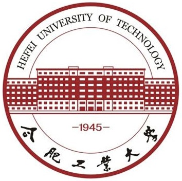
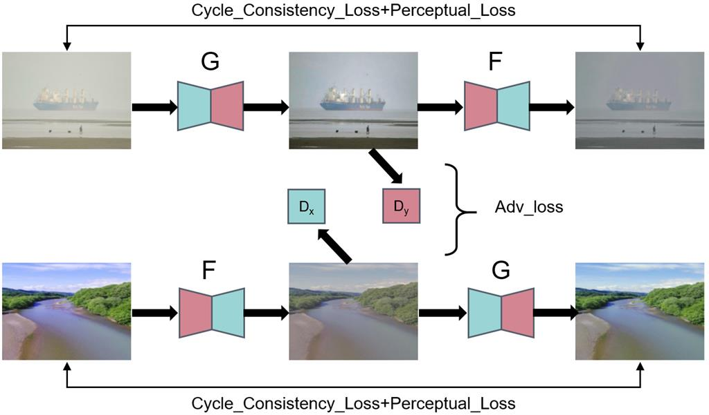

<!-- * B.S. in Communication Engineering, Hefei University of Technology, 2019
* M.S. in Computer Science and Technology, Harbin Institute of Technology, 2021
* Ph.D. in Computer Science and Technology, Harbin Institute of Technology, 2025 (expected) -->
Hi, this is Shunyuan Zheng. I am a third-year (2021~) Ph.D. student in Faculty of Computing, Harbin Institute of Technology, advised by Prof. [Shengping Zhang](https://homepage.hit.edu.cn/zhangshengping).
My research focuses on **human-centric 3D vision**, including 3D human reconstruction, novel view synthesis, etc.

## Background

<table style="width:100%;border:none;border-spacing:0px;border-collapse:separate;margin-right:auto;margin-left:auto;font-size: large">
<tr>
<td style="padding:20px;width:25%;vertical-align:middle;border:none" align="center">
 
</td>
<td style="padding:20px;width:75%;vertical-align:middle;border: none" align="left">
Ph.D. Student. Sep. 2021 - Jun. 2025 (Expected) 
<a href="https://encs.hit.edu.cn">Faculty of Computing</a> 
<a href="http://en.hit.edu.cn">Harbin Institute of Technology</a> 
</td>
</tr>

<tr>
<td style="padding:20px;width:25%;vertical-align:middle;border:none" align="center">
 
</td>
<td style="padding:20px;width:75%;vertical-align:middle;border: none" align="left">
Master of Engineering. Sep. 2019 - Jun. 2021 
<a href="https://cst.hitwh.edu.cn">School of Computer Science and Technology</a> 
<a href="https://www.hitwh.edu.cn">Harbin Institute of Technology (Weihai)</a> 
</td>
</tr>

<tr>
<td style="padding:20px;width:25%;vertical-align:middle;border:none" align="center">
 
</td>
<td style="padding:20px;width:75%;vertical-align:middle;border: none" align="left">
Bachelor of Engineering. Sep. 2015 - Jun. 2019 
<a href="https://ci.hfut.edu.cn/English/Home.htm">School of Computer Science and Information Engineering</a> 
<a href="https://www.hfut.edu.cn">Hefei University of Technology</a> 
</td>
</tr>
</table>    

## Research

<b>GPS-Gaussian: Generalizable Pixel-wise 3D Gaussian Splatting for Real-time Human Novel View Synthesis</b> 
<b>Shunyuan Zheng</b>, [Boyao Zhou](https://yaourtb.github.io), [Ruizhi Shao](https://dsaurus.github.io/saurus), [Boning Liu](https://liuboning2.github.io), [Shengping Zhang](http://homepage.hit.edu.cn/zhangshengping), [Liqiang Nie](https://liqiangnie.github.io), [Yebin Liu](http://www.liuyebin.com) 
<i>IEEE Conference on Computer Vision and Pattern Recognition (<b>CVPR</b>), 2024</i>  (Highlight) 
[<i class="fas fa-fw fa-globe"></i>Project](https://shunyuanzheng.github.io/GPS-Gaussian) /
[<i class="fas fa-fw fa-file-pdf"></i>Paper](https://arxiv.org/pdf/2312.02155.pdf) /
[<i class="fas fa-fw fa-video"></i>Video](https://youtu.be/TBIekcqt0j0) 

---

<b>Tele-Aloha: A Telepresence System with Low-budget and High-authenticity Using Sparse RGB Cameras</b> 
Hanzhang Tu, [Ruizhi Shao](https://dsaurus.github.io/saurus), Xue Dong, <b>Shunyuan Zheng</b>, Hao Zhang, Lili Chen, Meili Wang, Wenyu Li, Siyan Ma, [Shengping Zhang](http://homepage.hit.edu.cn/zhangshengping), [Boyao Zhou](https://yaourtb.github.io), [Yebin Liu](http://www.liuyebin.com) 
<i><b>SIGGRAPH<b> Conference Proceedings, 2024</i> 
[<i class="fas fa-fw fa-globe"></i>Project (coming soon)](blank) /
[<i class="fas fa-fw fa-file-pdf"></i>Paper (coming soon)](blank)

---

<b>Overwater Image Dehazing via Cycle-Consistent Generative Adversarial Network</b> 
<b>Shunyuan Zheng</b>, Jiamin Sun, [Qinglin Liu](https://scholar.google.com/citations?user=hsu1cSIAAAAJ), [Yuankai Qi](https://sites.google.com/site/yuankiqi), [Shengping Zhang](http://homepage.hit.edu.cn/zhangshengping) 
<i>Asian Conference on Computer Vision (<b>ACCV</b>), 2020</i> 
[<i class="fab fa-fw fa-github fa-github"></i>Code](https://github.com/ShunyuanZheng/OWI-DehazeGAN) /
[<i class="fas fa-fw fa-file-pdf"></i>Paper](https://openaccess.thecvf.com/content/ACCV2020/papers/Zheng_Overwater_Image_Dehazing_via_Cycle-Consistent_Generative_Adversarial_Network_ACCV_2020_paper.pdf) 

## Award
+ National Scholarship, Ministry of Education of China, 2020

## Contact
E-mail: sawyer0503[AT]hit.edu.cn 
WeChat: Tau97_Zheng
