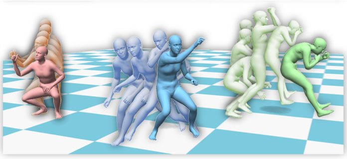

* B.S. in Communication Engineering, Hefei University of Technology, 2019
* M.S. in Computer Science and Technology, Harbin Institute of Technology, 2021
* Ph.D. in Computer Science and Technology,, Harbin Institute of Technology, 2025 (expected)

Publications
======

[CaPhy: Capturing Physical Properties for Animatable Human Avatars](https://suzhaoqi.github.io/projects/CaPhy/)

[Zhaoqi Su](https://suzhaoqi.github.io/), **Liangxiao Hu**, [Siyou Lin](https://jsnln.github.io/), [Hongwen Zhang](https://hongwenzhang.github.io/), [Shengping Zhang](http://homepage.hit.edu.cn/zhangshengping), [Justus Thies](https://justusthies.github.io/), [Yebin Liu](http://www.liuyebin.com/)

*In ICCV*, 2023

[Project Page](https://suzhaoqi.github.io/projects/CaPhy/) / [arXiv](https://arxiv.org/abs/2308.05925) 

[Real-time Monocular Full-body Capture in World Space via Sequential Proxy-to-Motion Learning](https://liuyebin.com/proxycap/)

[Yuxiang Zhang](https://zhangyux15.github.io/), [Hongwen Zhang](https://hongwenzhang.github.io/), **Liangxiao Hu**, [Hongwei Yi](https://xyyhw.top/), [Shengping Zhang](http://homepage.hit.edu.cn/zhangshengping), [Yebin Liu](http://www.liuyebin.com/)

[Project Page](https://liuyebin.com/proxycap/) / [arXiv](https://arxiv.org/pdf/2307.01200.pdf) 

