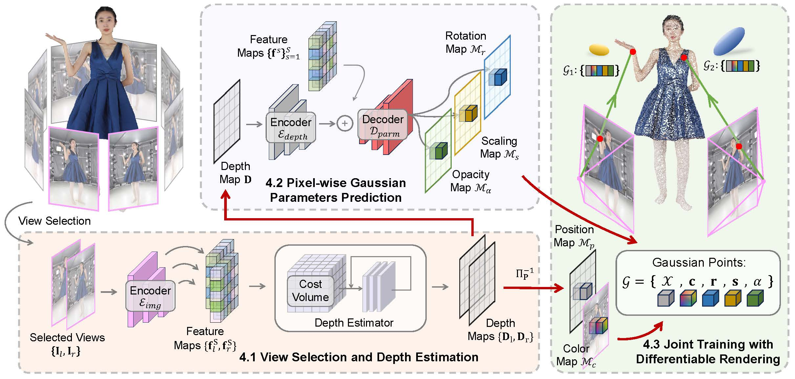

* B.S. in Communication Engineering, Hefei University of Technology, 2019
* M.S. in Computer Science and Technology, Harbin Institute of Technology, 2021
* Ph.D. in Computer Science and Technology, Harbin Institute of Technology, 2025 (expected)

Publications
======

<b>GPS-Gaussian: Generalizable Pixel-wise 3D Gaussian Splatting for Real-time Human Novel View Synthesis</b> 
<b>Shunyuan Zheng</b>, [Boyao Zhou](https://morpheo.inrialpes.fr/people/zhou), [Ruizhi Shao](https://dsaurus.github.io/saurus/), [Boning Liu](https://scholar.google.com/citations?user=PG1mUewAAAAJ), [Shengping Zhang](http://homepage.hit.edu.cn/zhangshengping), [Liqiang Nie](https://liqiangnie.github.io/), [Yebin Liu](http://www.liuyebin.com/) 
arXiv 2023 
[<i class="fas fa-fw fa-globe"></i>Projectpage](https://animatable-gaussians.github.io/) /
[<i class="fas fa-fw fa-file-pdf"></i>Paper](https://arxiv.org/pdf/2311.16096.pdf) /
[<i class="fas fa-fw fa-video"></i>Video](https://www.youtube.com/watch?v=kOmZxD0HxZI) 

---

<b>Overwater Image Dehazing via Cycle-Consistent Generative Adversarial Network</b> 
<b>Shunyuan Zheng</b>, Jiamin Sun, [Qinglin Liu](https://scholar.google.com/citations?user=hsu1cSIAAAAJ), [Yuankai Qi](https://sites.google.com/site/yuankiqi), [Shengping Zhang](http://homepage.hit.edu.cn/zhangshengping) 
<i>Asian Conference on Computer Vision (<b>ACCV</b>), 2020</i> 
[<i class="fas fa-fw fa-github"></i>Code](https://github.com/ShunyuanZheng/OWI-DehazeGAN) /
[<i class="fas fa-fw fa-file-pdf"></i>Paper](https://openaccess.thecvf.com/content/ACCV2020/papers/Zheng_Overwater_Image_Dehazing_via_Cycle-Consistent_Generative_Adversarial_Network_ACCV_2020_paper.pdf) 

<!-- **GPS-Gaussian: Generalizable Pixel-wise 3D Gaussian Splatting for Real-time Human Novel View Synthesis**

**Shunyuan Zheng**, [Boyao Zhou](https://morpheo.inrialpes.fr/people/zhou), [Ruizhi Shao](https://dsaurus.github.io/saurus/), [Boning Liu](https://scholar.google.com/citations?user=PG1mUewAAAAJ), [Shengping Zhang](http://homepage.hit.edu.cn/zhangshengping), [Liqiang Nie](https://liqiangnie.github.io/), [Yebin Liu](http://www.liuyebin.com/)
*arXiv preprint*, 2023
Project Page / arXiv

**Overwater Image Dehazing via Cycle-Consistent Generative Adversarial Network**

**Shunyuan Zheng**, Jiamin Sun, [Qinglin Liu](https://scholar.google.com/citations?user=hsu1cSIAAAAJ), [Yuankai Qi](https://sites.google.com/site/yuankiqi), [Shengping Zhang](http://homepage.hit.edu.cn/zhangshengping)
*Asian Conference on Computer Vision*(**ACCV**), 2020
[Code](https://github.com/ShunyuanZheng/OWI-DehazeGAN) / [Paper](https://openaccess.thecvf.com/content/ACCV2020/papers/Zheng_Overwater_Image_Dehazing_via_Cycle-Consistent_Generative_Adversarial_Network_ACCV_2020_paper.pdf)  -->